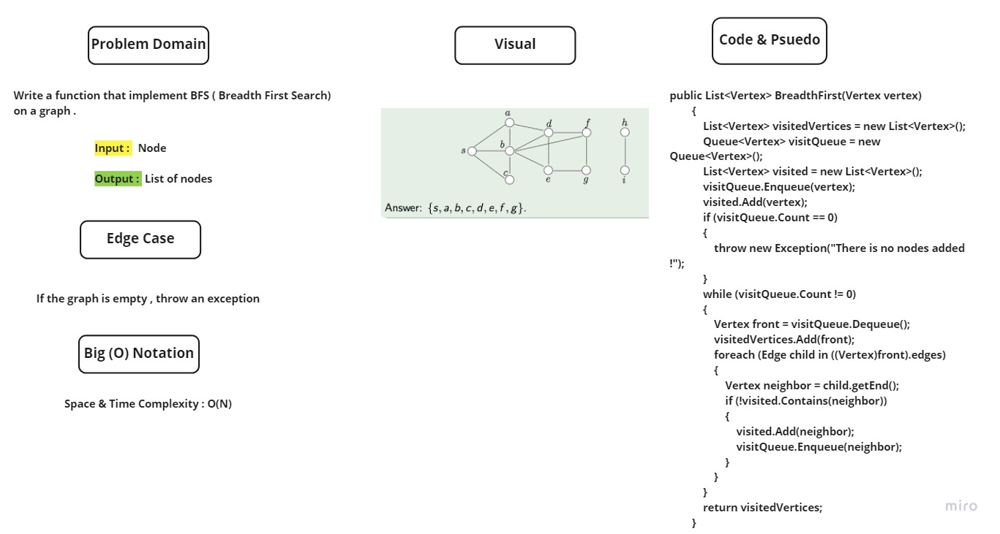

# Challenge Summary

***In this challenge , I suppose to create a function that implement graph breadth first traverse***

## Whiteboard Process

## Approach & Efficiency

***Time Complexity : O(N)***
***Space Complexity : O(N)***