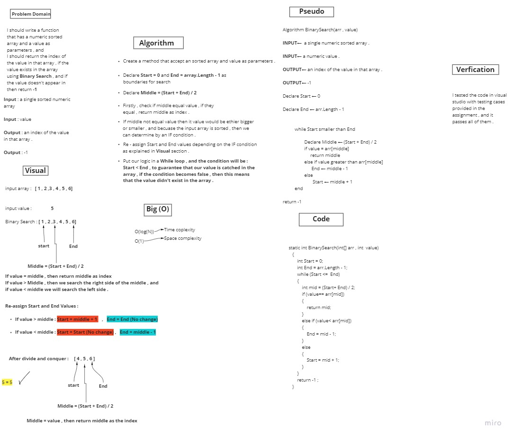

# Binary search of sorted array 

***This challenge requires to write a function that takes a value and an sorted array as parameters and return the index of the value in the array if it's exists , or -1 if it not exists***

---

## Whiteboard Process

---

## Efficiency and Approach

***O(Log(N)) for Time complexity***
***O(1) for Space complexity***

---

***Binary Search is more efficient than Sequential Search , becuase if we use Sequential Search in this challenge we will iterate in every element in the array , but with Binary Search we will not do that , due to Divide and Conquer mechanism***