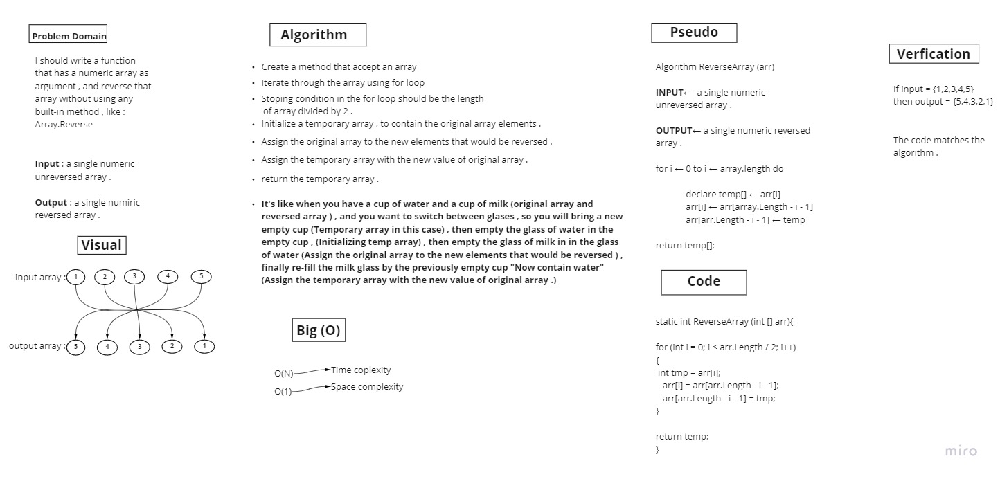

# Reverse an array 

***This challenge requires to make a whiteboard contains , Problem domain , Code ,Pseudo , Visual , Verfications , Big(O) and Algorithms components for reversing an array .***

---

## Whiteboard Process

---

### Efficiency and Approach

***O(N) for Time complexity***
***O(1) for Space complexity***