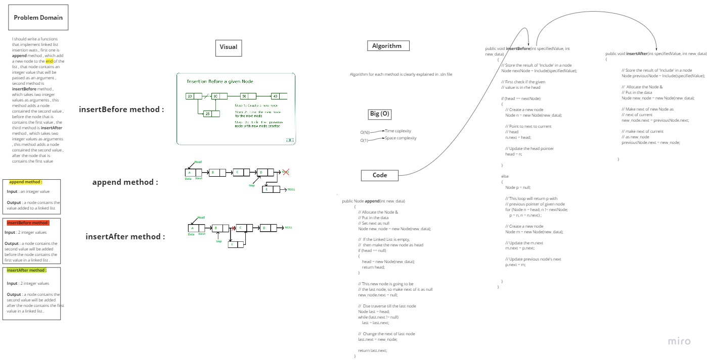
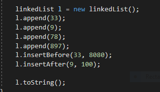
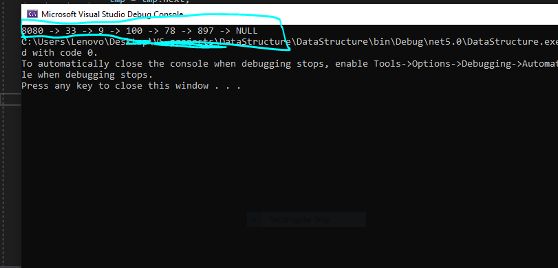

# Challenge Summary

---

***In this challenge , I suppose to implement linked list insertion methods , like add a value after the head of the linked list , add a value after a determined value and another method for adding before it .***

---

## Whiteboard Process

---

---

## Approach & Efficiency

---

***O(1) for space complexity***

***O(N) for time complexity***

---

## Solution

---

***This code is appending 33 , 9 , 78 , 897 to a linked list***
***then calling 'insertBefore' and 'insertafter' methods , which are take the first parameter***
***as the specified value to add before or after , and the second oparameter is the new value to add***

*The terminal :*

***8080 is added 33 , and 100 is added after 9***

---
